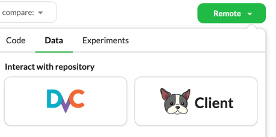
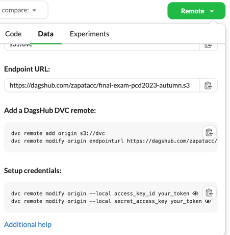

# Examen Final - Proyecto en Ciencia de Datos

## Información General

Este repositorio contiene todos los archivos e información esenciales necesarios para prepararse para el examen final del curso 'Proyecto en Ciencia de Datos' en la Universidad ITESO para el semestre de Otoño de 2023.

## Instrucciones

Antes de comenzar el examen, por favor, lea cuidadosamente las siguientes indicaciones:

- El objetivo de este examen es evaluar sus conocimientos como Científico de Datos en el desarrollo de un proyecto de principio a fin.
- Como líder de este proyecto, tiene la autoridad para tomar decisiones y asumir lo que considere necesario, siempre justificando sus elecciones.
- Se le presentará un escenario de la vida real con un conjunto de datos para abordar el problema.
- Clone este repositorio en su local `git clone git@github.com:zapatacc/final-exam-pcd2023-autumn.git` (Más abajo vienen las instrucciones para sincronizar los datos).
- Después de clonar, cree una rama con su nombre y apellido. Ejemplo: `cristian-zapata`
- Trabaje en dicha rama.
- La solución del problema debe abordar, como mínimo, los aspectos básicos de un proyecto de ciencia de datos, incluyendo:
  - Análisis Exploratorio de Datos.
  - Ingeniería de Características - Data Wrangling.
  - Entrenamiento, validación, evaluación y selección del modelo usando `mlflow` (Experimentos).
  - Microservicio (API) para servir el modelo.
  - Creación de imagen para la API. Incluya explicaciones y pruebas del contenedor ejecutando en local la API y probándola con `Postman`.
- Estructure el proyecto de manera asertiva; la selección de la estructura del proyecto será evaluada.
- Los archivos `requirements.txt` y `Dockerfile` son esenciales. Ubíquelos correctamente.
- Coloque el archivo `ExamenFinal.ipynb` en la carpeta raíz del repositorio.
- Use cuadernos de Jupyter y/o scripts de Python según la estructura del proyecto.
- La presentación del examen debe tener un formato adecuado, con tamaños de letra, colores y etiquetas apropiados.
- No se responderán dudas por parte del profesor o cualquier otro docente.
- Se evaluará la capacidad de interpretar resultados. Incluya sus interpretaciones y conclusiones.
- La calificación se distribuirá de la siguiente manera:

  | Aspecto a Evaluar                                            | Porcentaje |
  |--------------------------------------------------------------| ---------- |
  | Repositorio de Github/Dagshub debidamente configurado        | 10         |
  | Análisis Exploratorio de Datos                               | 10         |
  | Ingeniería de Características - Data Wrangling               | 10         |
  | Entrenamiento, validación, evaluación y selección del modelo | 20         |
  | Microservicio (API) para servir el modelo                    | 20         |
  | Creación de imagen para dicha API                            | 20         |
  | Conclusiones                                                 | 10         |

---

## Pull de los datos con `DVC`
- Instale el paquete dvc en su entorno virtual 
```
pip install --upgrade pip
pip install -U pyopenssl cryptography
pip install dvc
pip install dvc-s3
```
Ejecutar las siguientes isntrucciones en la terminal del proyecto:
```
dvc remote add origin -f s3://dvc
dvc remote modify origin endpointurl https://dagshub.com/zapatacc/final-exam-pcd2023-autumn.s3
```
- En el repositorio en `dagshub`, darle click en el botón verde `Remote` en la pestaña `Data` seleccionar la opción `DVC`

- Copiar las instrucciones de la sección `Setup credential` y ejecutarlas en la terminal local del proyecto
- 
- Finalmente ejecute el comando `dvc pull -r origin`